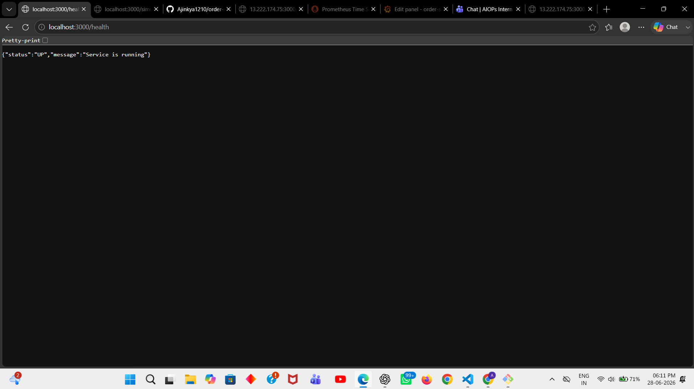
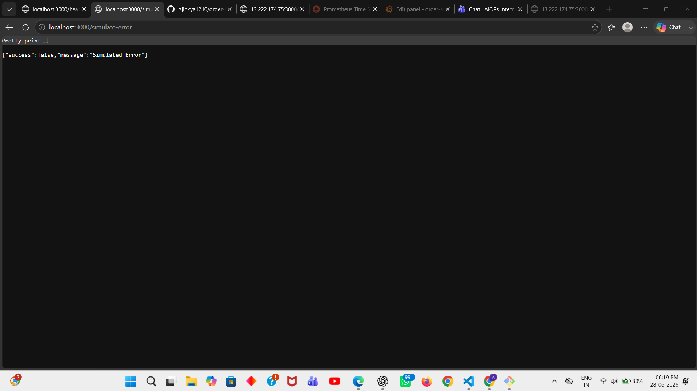
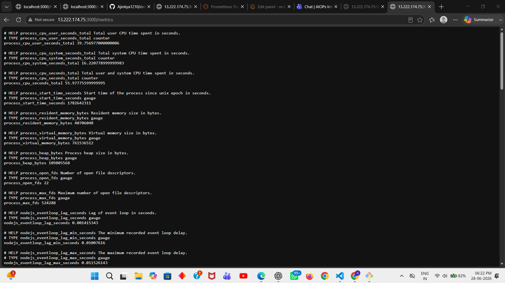
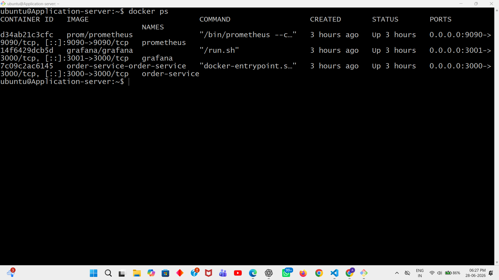
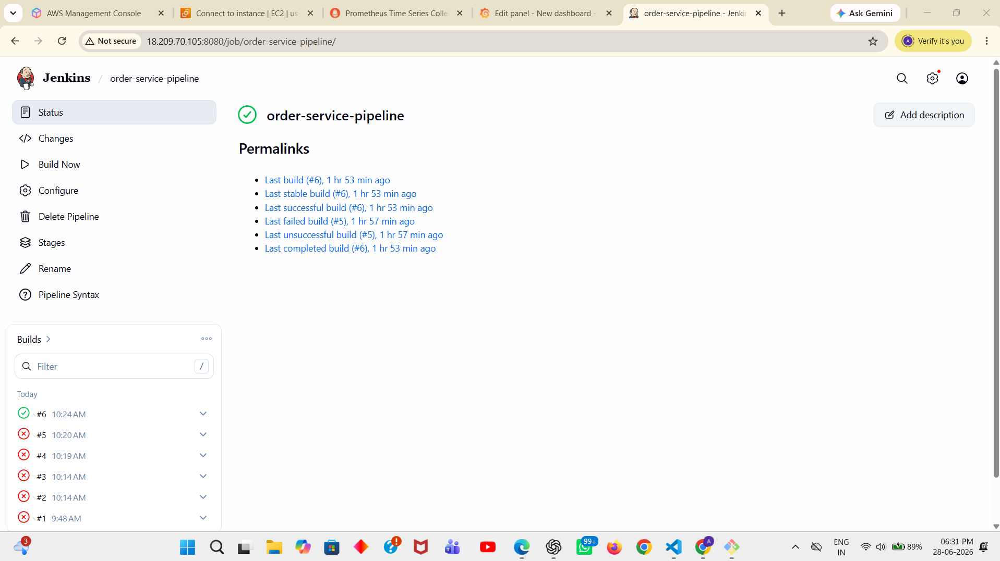
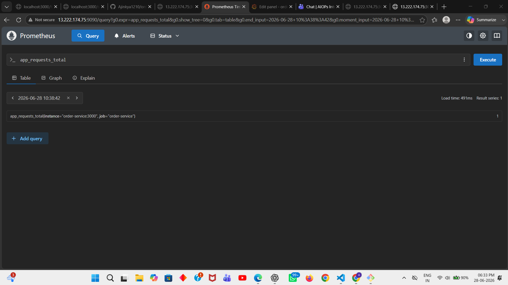
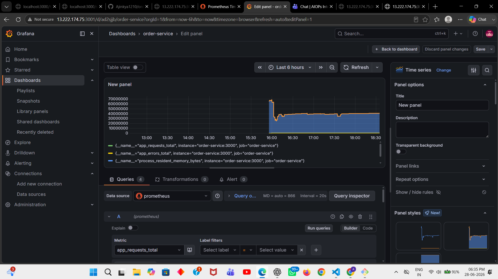

# Order Service - DevOps Project
##

### Overview
This project is a simple Node.js microservice built using TypeScript and Express. It demonstrates a complete DevOps workflow including containerization, CI/CD automation, monitoring, and deployment on AWS.
### Features
1.Health Check API

2.Job Processing API

3.Error Simulation API

4.Prometheus Metrics

5.Grafana Dashboard

6.Docker Containerization

7.Jenkins CI/CD Pipeline

8.AWS EC2 Deployment
 ### Tech Stack
 #### Application
1.Node.js

2.TypeScript

3.Express.js
### DevOps Tools
1.Docker

2.Docker Compose

3.Jenkins

4.GitHub
### Monitoring
1.Prometheus

2.Grafana
### Cloud
1.AWS Cloud

### AWS Infrastructure
#### API Endpoints
#### 1. Health Check

GET /health

Response:

{
    
    "status": "UP",

  "message": "Service is running"

}

### 2.Simulate Error

GET /simulate-error

Response:

{

  "success": false,

  "message": "Simulated Error"

}

### 3.Metrics

GET /metrics

Example:

app_requests_total 10

app_errors_total 2

### Docker Containers

#### docker ps

### CI/CD Pipeline

#### The Jenkins pipeline performs:

1.Checkout source code from GitHub

2.Connect to Application Server via SSH

3.Pull latest code

4.Build Docker containers

5.Deploy updated application

### Monitoring

### 1.Prometheus

### 2.Grafana

